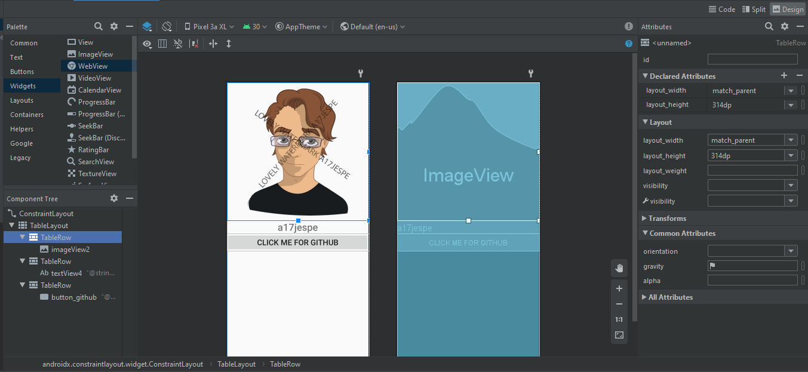

# Rapport

##### 1 - Layout and widgets

Through the utilization of the design interface I were able to easily add widgets and to some degree position them where I wanted.
I did have some issues when it came to positioning the elements in their horizontal aspect without causing any major unwanted effects.
At first the text wouldn't center properly due to the table row wanting to have 1/5th as empty space, but after some trial and error it was resolved.



The element choices for the image resulted in the following code:

```


        <TableRow

            android:layout_width="match_parent"
            android:layout_height="314dp"> //To my understanding, dp is the preferred measurement when deciding size as it translates easier to the device's pixel-measurements.

            <ImageView
                android:id="@+id/imageView2"
                android:layout_width="wrap_content"
                android:layout_height="420dp"  // Decides the height of the element
                android:layout_marginStart="0dp" // How far from the top which the element shall start. Increasing this will add distance between the top of the parent and/or previous element.
                android:layout_marginLeft="0dp"
                android:layout_marginTop="5dp" // How far from the previous element which this element starts. This has a similar functionality as marginStart but works in relation to other elements, marginStart fits the first element below a parent best, from my understand that is.
                android:layout_marginEnd="0dp"
                android:layout_marginRight="0dp"
                android:contentDescription="@string/author_img_content" //Reference to the string which describes the image. This says that I am the owner of the image.
                app:srcCompat="@drawable/pettan_e3_wm" /> //My added resource for the image which I load into the app.

        </TableRow>


```

##### 2 - Misc info

While utilizing solely the code-portion of designing UI probably works very well and allows fine-tuning in particular manner,
 the design GUI in Android Studio allows for a very beginner friendly approach before deep delving in the code-compartment.

The following image displays the resulting GUI. While it's not pretty, it is functional and was a practice-assignment.
The button opens the browser where my github is displayed. To make this function I imported two libraries, one named 'content.Intent' and one named 'net.Uri'.
They allowed me to easily open the link in a browser with a small amount of code. I believe webview would also enable this as I have in the previous assignment managed to do so by accident.
I could also have added a webview to the app and open it in the app, but I wanted to try using exterior resources.

